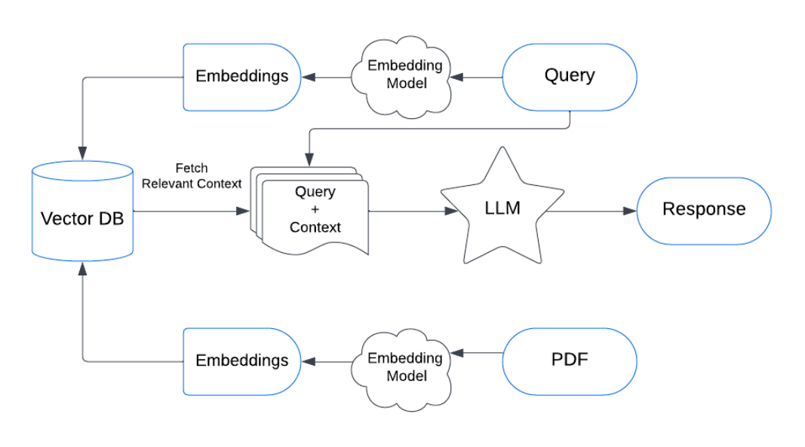
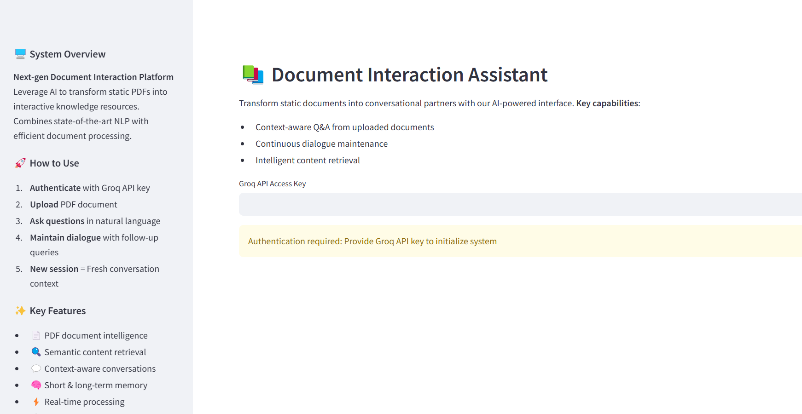

  # DocuChat-AI: History-Aware Document Interaction Assistant 🤖📄

  [](https://streamlit.io/)
  [](https://groq.com/)

  An AI-powered document analysis system that transforms static PDFs into conversational partners using cutting-edge NLP technologies.


  ## 🎯 Aim
  To create an intelligent document interaction system that:
  - Enables natural language Q&A with PDF documents
  - Maintains contextual conversation history
  - Provides accurate, document-specific responses
  - Processes sensitive documents locally for security

  ## 📖 About the Project
  This application combines modern NLP techniques with efficient document processing to create an interactive experience with PDF documents. Key features include:

  - **Document Intelligence**: Extract and understand PDF content
  - **Semantic Search**: Context-aware information retrieval
  - **Conversational Memory**: Maintains dialogue context
  - **Secure Processing**: Local file handling and processing

  
  ### How the Chatbot is History-Aware
  The chatbot uses a **memory management system** to store and retrieve conversation history. This allows it to:
  1. **Maintain Context**: It remembers the flow of the conversation, so you can ask follow-up questions without repeating context.
  2. **Provide Relevant Answers**: By analyzing past interactions, it delivers more accurate and contextually appropriate responses.
  3. **Enable Continuous Dialogue**: The chatbot can handle multi-turn conversations, making it ideal for complex document exploration.

  ## 🛠️ Tech Stack
  **Core Components**:
  - **Frontend**: `Streamlit`
  - **LLM**: `Groq (deepseek-r1-distill-llama-70b)`
  - **Vector DB**: `FAISS`
  - **Embeddings**: `HuggingFace (all-MiniLM-L6-v2)`
  - **NLP Framework**: `LangChain`

  **Supporting Libraries**:
  - `PyPDF` for document processing
  - `python-dotenv` for environment management
  - `langchain-community` for integrations

  ## 📁 File Structure
  ```bash
  document-assistant/
  ├── app.py               # Main application logic
  ├── README.md            # Project documentation
  ├── requirements.txt     # Dependency list
  ├── .env.example         # Environment template
  ├── LICENSE              # MIT License
  ├── .gitignore           # Ignore patterns
  └── screenshots/         # Demo images
      ├── workflow.png     # System architecture
      └── demo.png         # Interface preview
  ```

  ## 🔧 Setting Up Environment Variables

  To securely manage API keys, follow these steps:

  ### 📌  Create a `.env` File  
  Inside your project directory, create a file named **`.env`** and add the following:

  ```plaintext
  # .env file

  # Groq API Key
  GROQ_API_KEY="your_groq_api_key"

  # Hugging Face Token
  HF_TOKEN="your_huggingface_token"
  ```


  ## Run Locally

  Clone the project

  ```bash
    git clone https://github.com/uzairsayyed-005/DocuChat-AI

  ```

  Go to the project directory

  ```bash
    cd my-project
  ```

  Install dependencies

  ```bash
    pip install -r requirements.txt

  ```

  Start the server

  ```bash
    streamlit run app.py

  ```


  ## 📖 Theory and Approach

  ### 🔍 What is Retrieval-Augmented Generation (RAG)?  
  Retrieval-Augmented Generation (RAG) is an advanced technique that enhances the capabilities of large language models (LLMs) by integrating a retrieval system. Instead of relying solely on pre-trained knowledge, RAG retrieves relevant information from external sources (such as databases or documents) before generating responses.  

  #### ✅ **How RAG Works in This Project?**
  1. **User Query** → The user inputs a question.
  2. **Document Retrieval** → A vector database (FAISS) retrieves the most relevant document chunks.
  3. **Augmented Context** → Retrieved text is combined with the user query.
  4. **LLM Processing** → The model generates an informed response.
  5. **Response Generation** → The answer is returned to the user.

  ---

  ### 🛠️ **Project Workflow**
  Below is the **workflow of the document interaction system**, illustrating how a user query is processed using **RAG** and **LLM-based** response generation.

  ```mermaid
  graph TD;
      A[User Inputs a Query] -->|Step 1| B[Text Preprocessing]
      B -->|Step 2| C[Vectorization (Embeddings)]
      C -->|Step 3| D[FAISS Vector Search]
      D -->|Step 4| E[Retrieve Relevant Document Chunks]
      E -->|Step 5| F[Combine Query + Retrieved Data]
      F -->|Step 6| G[Pass to LLM (Groq Llama-70B)]
      G -->|Step 7| H[Generate Response]
      H -->|Step 8| I[Display Answer to User]
  ```
  ## RAG-Diagram

  

  ## Application interface

  
  ## 🔮 Future Work

  🚀 **Planned Improvements and Features:**

  ✔️ **Multi-Document Support** – Enable users to interact with multiple PDFs simultaneously.  
  ✔️ **Advanced OCR for Scanned PDFs** – Implement Optical Character Recognition (OCR) to process image-based PDFs.  
  ✔️ **API Integration for Chatbot Deployment** – Expose a REST API to integrate the assistant into other applications.  
  ✔️ **Improved Context Retention** – Enhance memory capabilities for better long-form interactions.  


  ## 👥 Contributors

  - **Uzair Sayyed** – [GitHub Profile](https://github.com/uzairsayyed-005)  
